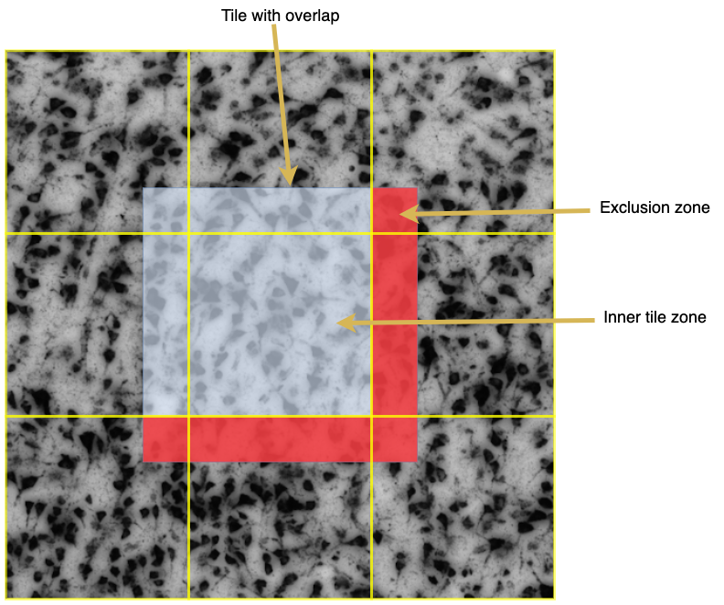

# demics

## Examples

### Adaptive Threshold & Connected Components
This simple example demonstrates how to use ```demics```.
Image data is loaded as a ```Tensor``` object. All operations in ```ops``` are applied iteratively on tiles of the input.
This sliding window approach enables the execution of memory intensive operations on very large inputs.

Additionally, without any changes to the code or syntax, all operations in ```ops``` can work in parallel with the use of ```MPI```.

````python
from demics import Tensor, ops

# Read volume from 2D slices
tensor = Tensor.from_file('volumes/img_Slice.*.tif')
tensor.min_reduce(axis=2)

mask: Tensor = ops.adaptive_threshold(tensor, constant=32., tile_size=512, overlap=32)
label: Tensor = ops.label(mask, tile_size=512, overlap=128)
visualization: Tensor = ops.scramble(label, tile_size=512, overlap=128)

visualization.astype('uint8').to_tif('demo_result.tif')
````

### Custom operations

Custom operations can easily be defined with the ```@ops.AtomicOp()``` and ```@ops.NonAtomicOp()``` decorators.
The ```@ops.NonAtomicOp()``` allows overlapping regions to the neighboring windows/tiles in the sliding window process, while the ```@ops.AtomicOp()``` does not.

````python
from demics import Tensor, ops
import numpy as np


@ops.AtomicOp()
def custom_op(inputs: np.ndarray, **kwargs):
    return inputs + 1


@ops.NonAtomicOp()
def custom_op_with_overlap(inputs: np.ndarray, **kwargs):
    return inputs + 2


tensor = Tensor.from_file('hdf5_file.h5:image')
result0 = custom_op(tensor, tile_size=512)
result1 = custom_op_with_overlap(tensor, tile_size=512, overlap=32)

````

## Using the Tensor class

```Demics``` handles all image related inputs and outputs with the use of the Tensor class. This class is an abstraction
of NumPy's ndarray and can be instantiated from various sources.

```python
from demics import Tensor

array = np.random.randint(0, 255, (128, 128, 3))
i = Tensor(array)
crop = i[32:96, 32:96]
```

### Reading
Multiple reading strategies are supported. They are listed below.
Per default, the data is being read from disk on first access. If the data is not accessed before a distributed
operation the reading also happens in a distributed manner.

#### Read single tif file
```python
i = Tensor.from_file('mytif.tif')
crop = i[500:550, 500:550]

print("Shape:", i.shape)
print("DType:", i.dtype)
```

#### Read multiple image files via pattern
Read all tif files in the current directory that match this pattern. The pattern follows **python regex**.
If multiple image files are read they are being stacked on the z-axis and yield a volume.
The shape then is `(height, width, depth, channels)`. Note that there are reduce operations like `i.min_reduce()` 
and `i.max_reduce()` which can reduce volumes to 2D data.
```python
i = Tensor.from_file('mytif_slice[0-9].tif')
i.max_reduce()
crop = i[500:550, 500:550]
```

#### Read multiple image files via templating
Use the filename as a template and replace the `numbers` numeric chars that are expected to follow `prefix`
with the set of numbers that is defined by `id_range`. For example, an id range of `id_range='1-3,5-6'` would be 
resolved to `{1, 2, 3, 5, 6}`.
```python
i = Tensor.from_file('mytif_slice0.tif', id_range='0-9', prefix='_slice', numbers=1)
crop = i[500:550, 500:550, 4:6]
```

#### Read single hdf5 dataset
```python
i = Tensor.from_file('myh5file.h5:image')
crop = i[500:550, 500:550]
```

#### Read multiple hdf5 datasets via pattern
```python
i = Tensor.from_file('myh5file.h5:slice[0-9]')
crop = i[500:550, 500:550]
```

#### Read multiple hdf5 datasets via templating
```python
i = Tensor.from_file('myh5file.h5:slice0', id_range='0-9', prefix='slice', numbers=1)
i.min_reduce()
crop = i[500:550, 500:550]
```

## Tiling strategy


### Exclusion rules
The use of tiling with overlap necessitates exclusion rules to avoid multi detection of object
instances in different tiles.

These are the rules:
- Exclude all object instances that share pixels with the *exclusion zone* (red).
- Exclude all object instances that share no pixels with the *inner tile zone*.

A warning is prompted if an object instance is part of a tile and touches the upper or left border of the overlap
zone, as this indicates that the overlap is not large enough.
